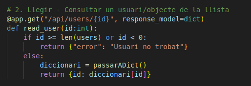
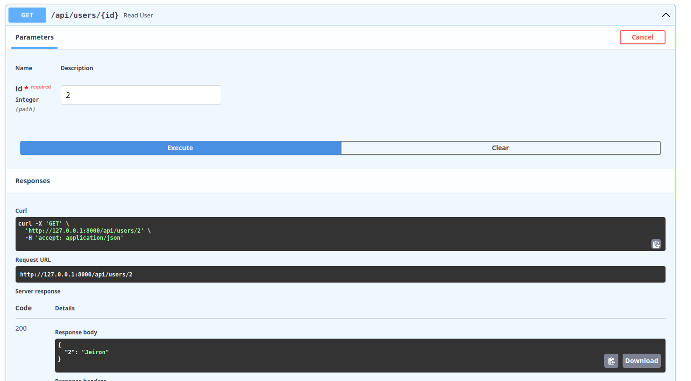

<h1>FastAPI_Sevilla</h1>

<h2>Activitat FastAPI Basics</h2>
    

        En primer lloc, el codi emprat per a la creació dels endpoints requerits és el següent:
    

    
    
    

        Tal com es pot veure tenim una llita d'usuaris, i una funció que el que fa és convertir aquesta llista a diccionari. He fet la funció "passarADict" per tal d'estalviar-me codi, i redundància, en els diferents endpoints.
        En el moment d'executar-ho amb la documentació de FastAPI, Swagger, ens donaria aquest resultat:
    

    
    

        A partir d'aqui, anem veient qué fa individualment cada endpoint.
    

    <h3>Crear - Afegir a la list</h3>
        

            En primer lloc, volem que, mitjançant el mètode POST, es puguin crear usuaris nous i afegir-los a la llista. Per paràmetres demanem un nom, que serà el nom del nou usuari, i l'afegirà a la llista.     
        

        
        
        

            En aquest cas, farem clic a "Try it out" i afegirem l'usuari "Lucía":
        

        
        

            Posteriorment, mitjançant la funció que he comentat abans es convertirà la llista, amb el nou usuari, a diccionari, i finalment retornarà aquest diccionari.
        

        
        
    <h3>Llegir - Consultar un usuari/objecte de la llista</h3>
        

            Ara mitjançant el mètode GET, volem consultar un usuari de la llista tot introduint el seu ID. Per aquest mètode he fet servir un condicional per tal que si l'ID introduït no existeix, doni un missatge d'error. En cas que sí que existeixi, sí que es podrà consultar l'usuari en qüestió.
        

        
        
        

            Com hem fet abans, li donarem a "Try it out" i introduirem l'ID en qüestió, en aquest cas el "2":
        

        
    <h3>Llegir - Consultar tots els usuaris</h3>
        

            Ara volem, mitjançant el mètode GET llegir tots els usuaris. Un cop li donem a executar ens apareixerà la llista dels usuaris, amb l'usuari Lucía anteriorment afegida.
        

        
        
        
    <h3>Actualitzar - Actualització completa</h3>
        

            En aquest punt el que es pretén és que, mitjançant el mètode PUT, puguem actualitzar un usuari de la llista.
            Tal com passava amb la consulta individual per ID, en aquest punt he fet un condicional que, en cas que l'ID no estigui, doni un missatge error. En canvi, en cas que l'ID que donem sí que existeixi, actualitzarà el nom de l'usuari en qüestió, pel que volguem. 
        

        
        
        

            En la següent captura es pot veure què passaria si m volem canviar-li el nom a un ID, el 5, que no existeix a la llista:
        

        
        

            En canvi, si ho fem amb un ID que sí que existeix, per exemple, el 0, actualitzant el seu nom de "Adrián" a "Adrià":
        

        
    <h3>Eliminar - Esborrar usuari</h3>
        

            Finalment, si volem esborrar un usuari, ho farem amb el mètode DELETE:
        

        
        

            Actualment tenim aquesta llista d'usuaris:
        

        
        

            Haurem d'introduir el ID de l'usuari que volem esborrar, i com en els casos anteriors, si introduïm un ID que no existeix, ens sortirà un missatge d'error:
        

        
        

            En canvi, si volem eliminar un ID, per exemple el 2, funcionarà perfectament, i ens esborrarà l'usuari en qüestió. I a més, ara, Lucía passarà de ser l'ID 3, a ser la 2.
        

        